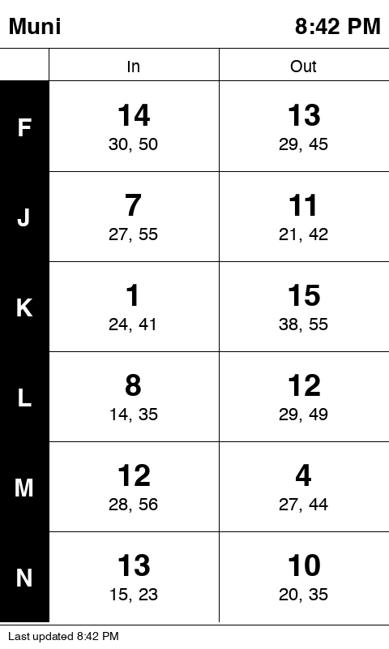

# ESP32 Firmware — Transit Display

Self-contained MicroPython firmware for the **Waveshare e-Paper ESP32 Driver Board** driving a **Waveshare 7.5" V2** e-paper display (800×480, black/white).

No Raspberry Pi required.  The ESP32 fetches the 511.org API directly over WiFi, renders the transit layout natively, and uses deep sleep to minimise power consumption.



---

## Hardware

| Component | Part |
|-----------|------|
| Compute + WiFi | [Waveshare e-Paper ESP32 Driver Board](https://www.waveshare.com/e-paper-esp32-driver-board.htm) |
| Display | [Waveshare 7.5" V2 e-Paper](https://www.waveshare.com/7.5inch-e-paper-hat.htm) (800×480 B/W) |

Connect the display's 8-pin FFC cable to the driver board's display connector.  No additional wiring is required — all SPI lines are hardwired on the board PCB.

---

## Setup

### 1. Install MicroPython on the ESP32

Download the latest ESP32 MicroPython firmware from https://micropython.org/download/esp32/

Flash it with `esptool`:

```bash
pip install esptool
```

Put the board into download mode: **hold the BOOT button, press and release RST, then release BOOT.**

```bash
# Erase first
esptool.py --chip esp32 --port /dev/tty.usbmodem* erase_flash

# Flash (replace the filename with the one you downloaded)
esptool.py --chip esp32 --port /dev/tty.usbmodem* write_flash -z 0x1000 esp32-*.bin
```

After flashing completes, **press RST** (without holding BOOT) to reboot into MicroPython.

On macOS the port is typically `/dev/tty.usbmodem*` or `/dev/tty.usbserial*`; on Linux `/dev/ttyUSB0`.

### 2. Create `config.py`

Copy the sample config and fill in your values:

```bash
cp sample.config.py config.py
```

Edit `config.py` with your stop IDs and API key (it is excluded from the repo via `.gitignore` so your credentials stay local):

```python
WIFI_SSID     = "YourNetwork"
WIFI_PASSWORD = "YourPassword"
API_KEY       = "your-511-api-key"
TZ_OFFSET_SEC = -7 * 3600      # PDT (UTC-7); use -8*3600 for PST
```

The `STOPS` and `LINES` dicts mirror the YAML structure exactly:

| config.yaml | config.py |
|-------------|-----------|
| `stops.main_inbound.id: '15727'` | `STOPS = {"main_inbound": {"id": "15727", "agency": "SF"}}` |
| `lines[0].label: "N"` | `LINES = [{"label": "N", "inbound_stop": "main_inbound", ...}]` |

See the comments in `config.py` for a BART example.

**Daylight saving time:** `TZ_OFFSET_SEC` does not auto-adjust for DST.  Update it manually in spring and autumn (or use -8*3600 / -7*3600 for PST/PDT).

### 3. Upload files to the ESP32

Install [mpremote](https://docs.micropython.org/en/latest/reference/mpremote.html) and run the upload script:

```bash
pip install mpremote

cd esp32/
./upload.sh
```

The script auto-detects the USB-serial port.  If you have multiple serial devices connected, pass the port explicitly:

```bash
./upload.sh /dev/tty.usbmodem1234
```

On macOS the port is typically `/dev/tty.usbmodem*` or `/dev/tty.usbserial*`; on Linux `/dev/ttyUSB0` or `/dev/ttyACM0`.

After uploading it resets the device automatically.  Alternatively, use [Thonny IDE](https://thonny.org) to drag-and-drop the files.

### 4. Verify

Open the serial REPL (115200 baud) to monitor boot output.  You should see:

```
Connecting to WiFi: YourNetwork
WiFi connected: 192.168.1.x
NTP sync OK: 2025-04-08T18:30:00Z
Local hour: 11
Fetching stop: main_inbound
  28 arrivals for main_inbound
Fetching stop: main_outbound
  30 arrivals for main_outbound
Rendering display: 11:30 AM
Done. Sleeping 65s
```

The display should update within ~15 seconds of boot.

---

## How it works

```
boot (every 65s via deep sleep)
  │
  ├── load state from RTC memory (survives deep sleep)
  ├── check local hour
  │
  ├── if off-hours (1 AM–5 AM):
  │     show "not in service" screen once
  │     run 3×B/W maintenance cycle at 3 AM (once per night)
  │     deep sleep 5 minutes, repeat
  │
  └── if service hours (5 AM–1 AM):
        connect WiFi → NTP sync
        fetch 511.org API for each stop
        disconnect WiFi (frees heap for 48 KB framebuffer)
        render layout → push to display
        deep sleep 65 seconds
```

The `shared/transit_data.py` and `shared/arrival_fmt.py` modules are identical to the code used by the Raspberry Pi version — no duplication.

---

## Power consumption

| State | Current |
|-------|---------|
| Active (WiFi + rendering) | ~150 mA |
| Deep sleep | ~10 µA |
| Average over 65s cycle (~15s active) | ~35 mA |

Power the board via USB-C.  The board also has a JST-PH 2-pin connector for a LiPo battery, enabling fully untethered operation.

---

## Differences from the Raspberry Pi version

| Feature | Raspberry Pi | ESP32 |
|---------|-------------|-------|
| Language | Python 3 | MicroPython |
| Rendering | HTML → WeasyPrint → PIL image | framebuf pixel drawing |
| Fonts | System TrueType fonts | Helvetica TrueType via font_to_py |
| Web server | Flask on port 8080 | None |
| Config | `config.yaml` | `config.py` |
| Startup | systemd service | Runs on boot automatically |
| Deployment | `deploy.sh` via SSH | `mpremote cp` |
| Power management | Always-on | Deep sleep between refreshes |
| Emoji (🦉, 🚀) in arrival times | Rendered | Stripped (numbers still show) |

---

## Fonts

The font `.py` files (`font_bold_36.py`, `font_bold_26.py`, `font_20.py`) are pre-generated from Helvetica and included in the repo.  To regenerate them (e.g. to change sizes or use a different font):

```bash
pip install freetype-py fonttools

cd esp32/

# Extract standalone TTFs from the macOS TTC collection
python3 -c "
from fontTools.ttLib import TTCollection
ttc = TTCollection('/System/Library/Fonts/Helvetica.ttc')
ttc[1].save('Helvetica-Bold.ttf')      # face 1 = Bold
ttc[0].save('Helvetica-Regular.ttf')   # face 0 = Regular
"

# Download the converter
curl -fsSL https://raw.githubusercontent.com/peterhinch/micropython-font-to-py/master/font_to_py.py -o font_to_py.py

CHARSET="0123456789ABCDEFGHIJKLMNOPQRSTUVWXYZabcdefghijklmnopqrstuvwxyz :,."
python3 font_to_py.py -x -c "$CHARSET" Helvetica-Bold.ttf    36 font_bold_36.py
python3 font_to_py.py -x -c "$CHARSET" Helvetica-Bold.ttf    26 font_bold_26.py
python3 font_to_py.py -x -c "$CHARSET" Helvetica-Regular.ttf 20 font_20.py

# Clean up
rm Helvetica-Bold.ttf Helvetica-Regular.ttf font_to_py.py
```

On Linux, substitute your system bold/regular TTF paths (e.g. `/usr/share/fonts/truetype/dejavu/DejaVuSans-Bold.ttf`).

---

## Troubleshooting

**Display shows nothing / BUSY pin hangs**
- Confirm the FFC cable is fully seated in both the board and display connectors.
- Try reducing SPI clock: in `display_epd.py` change `baudrate=4_000_000` to `baudrate=2_000_000`.

**WiFi connects but 511.org returns errors**
- Verify `API_KEY` is correct.  Test in a browser: `https://api.511.org/transit/StopMonitoring?api_key=KEY&agency=SF&stopcode=15727&format=json`
- The 511.org API enforces per-key rate limits.  If the Pi and ESP32 both run simultaneously they share the same key quota.

**`MemoryError` during fetch**
- The 511.org response can be 20–60 KB.  Reduce `MaximumStopVisits=30` in `_fetch_all_stops()` inside `main.py` to `MaximumStopVisits=10`.
- Ensure `wifi_ntp.disconnect()` is called before rendering (it is by default).

**Time is wrong after DST change**
- Update `TZ_OFFSET_SEC` in `config.py` and re-upload the file.

**Ghosting on the display**
- The automatic 3 AM maintenance cycle should clear this overnight.
- For immediate relief: connect to the REPL and run:
  ```python
  from display_epd import EPD
  epd = EPD(); epd.init(); epd.clear(); epd.sleep()
  ```
